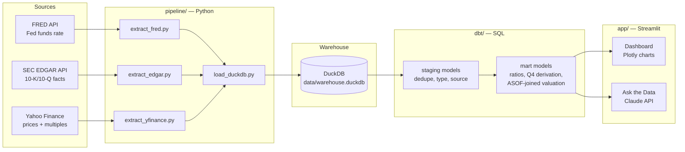

# How did Fed rate hikes since 2022 affect Big Tech balance sheet leverage and valuation?

A small, finished, end-to-end analytics project covering **Microsoft, Apple, Alphabet, Amazon,
and Meta** from 2021 through the present. It pulls raw financial and macro data from public
APIs, models it into leverage and valuation metrics with dbt, and serves the result as a
Streamlit dashboard with an AI chat layer grounded in the curated dataset.

**Live app:** https://fed-rates-big-tech-leverage-85wksgqdbzf2pvdbgrp3af.streamlit.app

## The question, briefly answered

Fed funds rate went from ~0.1% (early 2021) to a peak above 5% (mid-2023) before easing back to
~3.6% today. Over that window:

- **Big Tech market caps dipped through 2022** (the steepest part of the hiking cycle) and have
  since more than recovered — GOOGL, META, and MSFT are all well above their pre-hike levels.
- **Leverage moved in different directions by company.** AAPL's debt-to-equity ratio roughly
  doubled from ~0.9 (2021) to a peak near 2.2 (2022) as it kept buying back stock against a
  shrinking equity base, then fell back toward ~0.8 as equity rebuilt. MSFT, GOOGL, and AMZN kept
  debt-to-equity low and comparatively flat throughout.
- **EV/EBITDA multiples compressed during the hiking cycle** and expanded again as rates eased,
  visually tracking the rate cycle.
- **But the rigorous version of that story is weaker than the chart suggests.** Regressing
  month-over-month % change in market cap against month-over-month change in the Fed funds rate
  (pooled across all five companies, n=335 company-months) gives a small negative coefficient
  (-4.06 pp of market cap growth per +1pp of rate change) with R² = 0.007 and p = 0.12 — not
  statistically significant at conventional thresholds. Per-company results vary in both sign and
  magnitude. The multi-year *trends* clearly move together; the *month-to-month* relationship is
  noisy. See the dashboard's "Statistical Analysis" section for the full regression, including why
  it's built on differenced (not level) series to avoid spurious correlation between two trending
  time series.

Explore the detail in the live dashboard, or ask the chat tab a specific question about any of
the five companies — its answers are grounded in the same regression output.

## Architecture



## Data sources (all free)

- **[FRED API](https://fred.stlouisfed.org/docs/api/fred/)** — effective Fed funds rate (`FEDFUNDS`), 10Y treasury (`DGS10`)
- **[SEC EDGAR `companyconcept` API](https://www.sec.gov/edgar/sec-api-documentation)** — balance sheet and income statement facts, pulled per XBRL tag
- **Yahoo Finance (via `yfinance`)** — daily prices and a current-point valuation snapshot (market cap, EV, shares outstanding)

## Stack

| Layer | Tool | Why |
|---|---|---|
| Extraction | Python (`requests`, `yfinance`) | Pull from FRED / EDGAR / Yahoo Finance |
| Warehouse | DuckDB | File-based, zero hosting, ships inside the repo |
| Transformation | dbt Core + `dbt-duckdb` | SQL-based, tested, documented |
| Dashboard | Streamlit + Plotly | Fast to build, deploys straight from GitHub |
| Statistical modeling | `statsmodels` (OLS) | Regresses differenced series to quantify (and honestly caveat) the rate/valuation relationship |
| AI chat | Claude API (`claude-opus-5`) | Prompt-grounded Q&A over the curated dataset + regression output |

## Repo structure

```
pipeline/    Python extraction scripts + DuckDB loader
dbt/         dbt project: staging models, mart models (ratios, valuation), tests
app/         Streamlit app (dashboard + chat)
data/        DuckDB warehouse file (committed) + raw/ (gitignored, regenerated by pipeline)
```

## Data modeling notes (the interesting bits)

- **SEC XBRL facts get restated across filings** — a 10-K reports the prior year's quarters as
  comparatives. `stg_edgar_facts` dedupes to the most-recently-filed version of each
  (ticker, concept, period).
- **Q4 is never filed as its own quarter.** Companies tag Q1-Q3 as discrete 3-month durations,
  but the fourth quarter only shows up inside the annual (10-K) total. `fct_income_statement_quarterly`
  derives Q4 = FY total − (Q1+Q2+Q3), bucketed by date-range membership against each annual
  period (not by SEC's own `fy`/`fp` fields, which reflect the *filing* that reported a fact, not
  the fact's intrinsic period, and become unreliable after deduping).
- **No look-ahead bias.** `fct_valuation_daily` uses DuckDB's `ASOF JOIN` to match each price date
  to the most recently *filed* (not most recent period-end) financials — a metric is only visible
  on a given day if it had actually been publicly reported by then.
- **Market cap and EV are approximated** using *current* shares outstanding applied to historical
  prices, since Yahoo Finance's free tier doesn't expose historical share counts. This is a
  documented simplification, not a restatement of actual historical share count.
- **AMZN doesn't tag a total `Liabilities` XBRL fact directly** — `fct_balance_sheet_quarterly`
  derives it from the accounting identity (`Assets - StockholdersEquity`) when missing.

## Running it locally

```bash
python -m venv .venv
.venv\Scripts\pip install -r requirements.txt      # Windows
# .venv/bin/pip install -r requirements.txt          # macOS/Linux

cp .env.example .env   # fill in FRED_API_KEY and ANTHROPIC_API_KEY

python pipeline/extract_fred.py
python pipeline/extract_edgar.py
python pipeline/extract_yfinance.py
python pipeline/load_duckdb.py

cd dbt && DBT_PROFILES_DIR=. dbt run && dbt test && cd ..

streamlit run app/app.py
```

`FRED_API_KEY` is free at <https://fred.stlouisfed.org/docs/api/api_key.html>.
`ANTHROPIC_API_KEY` is from <https://console.anthropic.com>. Both are optional for exploring the
dashboard against the data already committed in `data/warehouse.duckdb` — they're only needed to
re-run the pipeline or use the chat tab.

## Deploying

`data/warehouse.duckdb` is a built artifact checked into the repo (not gitignored) so Streamlit
Community Cloud can serve the dashboard with zero external database — no separate hosting step.
To refresh the data, re-run the pipeline + `dbt run` locally and commit the updated
`.duckdb` file. Set `ANTHROPIC_API_KEY` in the app's Streamlit Cloud secrets to enable the chat tab.

## Context

Built as a public, non-NDA'd proof point of data engineering skills — Python extraction, a tested
dbt transformation layer, and an AI-chat layer grounded in a curated dataset — aimed at
Data Engineer / Analytics Engineer roles.
